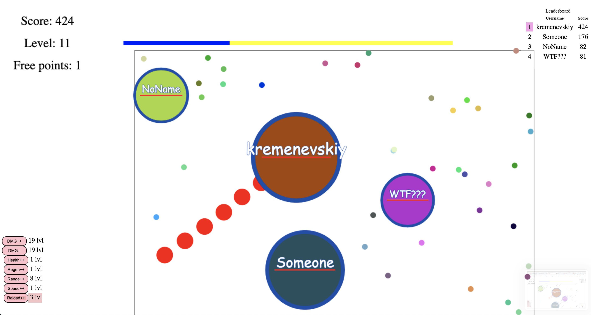
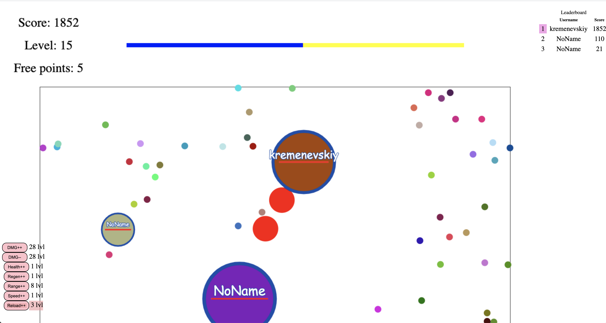
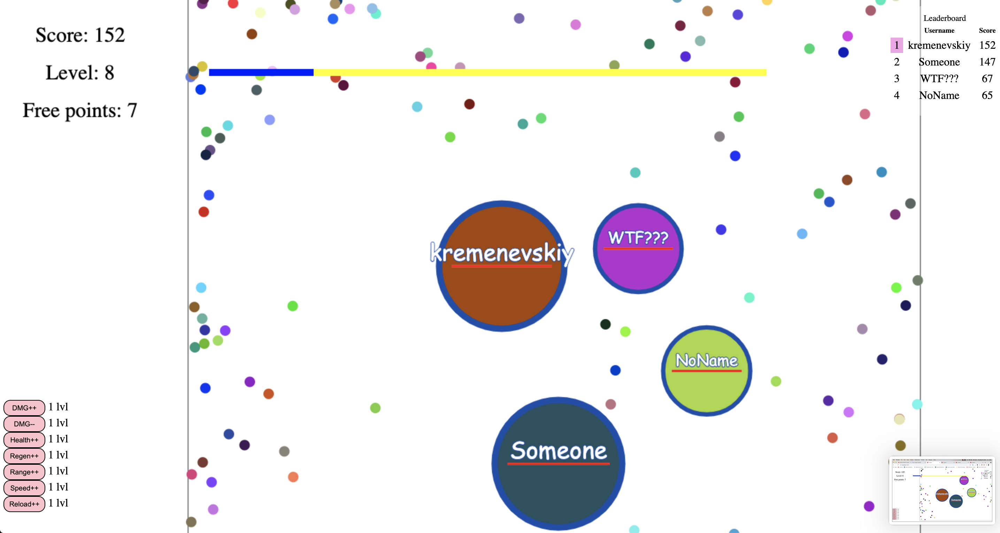

## Multiplayer Server-Client IO.GAME

> Fan fact: Idea was to write funny online game, so I think did it :)

> Fan fact-2: It is my first javascript project and first experience with webDev

> Fact : The game will continue to develop 

---
###Game preview

___

## How to run:
###1. Run Server
#### Run Server in develop mode
```angular2html
1. npm run all
2. npm run dev -> npm run develop 
```

#### Run Server in production mode
```bash
1. npm run build -> npm run start
2. npm run prod
```
### 2. Visit localhost on port 3000 in browser
#### In Browser:
```bash
http://localhost:3000
```

### 3. Invite friends, join local network and
## PLAY 😈 !!!


___

### Languages and frameworks used in project:
* JavaScript
* Node
* HTML + CSS

___

### More gameplay:





